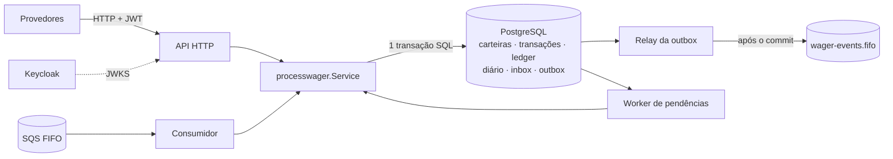

# Wager Service


Serviço distribuído em Go que processa operações financeiras de provedores de jogos (`BET`, `WIN`,
`LOSS`, `REFUND`, `ROLLBACK`) sobre carteiras de jogadores, por **HTTP e por SQS**, sem nunca perder,
duplicar ou reordenar dinheiro, mesmo com várias instâncias, reentregas e quedas no meio do caminho.

Feito por **leandropeloso** como resposta ao desafio descrito em [DESAFIO.md](DESAFIO.md).

## O que está em jogo

Num sistema de apostas, o erro caro não é derrubar uma requisição: é **debitar duas vezes**, deixar
o saldo ficar negativo ou publicar um evento de uma transação que não existe. O projeto trata essas
garantias como o centro do desenho, e cada uma é imposta no próprio banco, não só no código.

| Garantia | Como é resolvida | Prova |
| --- | --- | --- |
| Mesma operação nunca debita duas vezes | Idempotência persistente (`UNIQUE` por provedor + hash do conteúdo), válida para HTTP, SQS e reinícios | 50 envios simultâneos por 3 processos geram um único débito |
| Saldo nunca fica negativo nem perde atualização | Lock por carteira (`FOR NO KEY UPDATE`) + versão + `CHECK` no banco; sem lock global | Duas apostas de 80,00 sobre 100,00: uma passa, outra é rejeitada |
| Evento só existe se a transação existe | Outbox transacional: evento e saldo no mesmo commit, publicação depois | Processo morto entre publicar e confirmar: outro assume, mesmo `eventId` |
| Mensagem SQS reentregue não repete efeito | Inbox na mesma transação do negócio | Consumidor morto após o commit: reentrega sem segundo débito |
| Ledger e saldo não divergem | Ledger append-only e *constraint triggers* diferidos que conferem saldo e versão no commit | Teste que burla a aplicação e tenta gravar direto no banco |
| Estorno que chega antes da aposta | `PENDING_REFERENCE` durável com backoff, TTL e resolução em qualquer instância | Estorno antes da aposta é resolvido depois; expira se a aposta nunca vem |
| Contabilidade auditável | Livro-diário de **partidas dobradas** (débitos = créditos por movimento) e balancete | Invariantes verificadas por SQL independente da aplicação |
| Acesso a dados de outro provedor | JWT do Keycloak validado por JWKS; `providerId` vem do token, nunca do corpo | Provedor A recebe `403`/`404` ao tentar ler dados do B |

Além do que o enunciado pede, há também **rastreamento OpenTelemetry** (um trace atravessa HTTP,
banco, outbox e SQS, visível no Jaeger) e **controle de acesso do broker** com políticas IAM de menor
privilégio, verificadas contra um emulador que as impõe.

## Arquitetura



Um único caso de uso (`processwager.Service`) atende HTTP, SQS e o worker de pendências. Cada operação
é **uma transação SQL** que grava transação, saldo, ledger, diário, inbox e outbox juntos; o resto
(publicar, retomar pendências) acontece depois, de forma durável. Camadas em `internal/`: `domain`
(modelo puro, sem framework), `app` (casos de uso e *ports*), `infra` (PostgreSQL, SQS, HTTP, auth) e
`platform` (composição com Uber Fx e ciclo de vida ordenado).

## Veja funcionando em dois minutos

Precisa só de Docker com Compose v2.

```sh
docker compose up -d --build
curl localhost:8081/health/ready
```

Sobem PostgreSQL, Keycloak (realm importado), LocalStack (filas), Jaeger e **três instâncias
independentes** da aplicação em `:8081`, `:8082` e `:8083`. Exemplos de chamadas completos, com
tokens, estão em [Início rápido](#início-rápido) mais abaixo. Para a jornada inteira de uma vez
(PowerShell 7):

```powershell
pwsh scripts/e2e.ps1
```

Depois, abra o Jaeger em <http://localhost:16686> para ver o trace de uma aposta e use
[`scripts/db.ps1`](scripts/db.ps1) para inspecionar o banco (veja [Consultando o banco](#consultando-o-banco)).

## Como foi verificado

| O quê | Resultado |
| --- | --- |
| Testes unitários (`go test -race`, 15 pacotes, mais fuzz do parser monetário) | passam |
| Integração com infraestrutura **real** (PostgreSQL, Keycloak, LocalStack, Jaeger), servidores compilados com `-race` | 60 de 60, em duas execuções seguidas, sem `DATA RACE` |
| Ponta a ponta pelas 3 instâncias (`scripts/e2e.ps1`) | 40 de 40 verificações |
| Carga: 30 s, 32 clientes, 200 carteiras, 3 instâncias | ≈ 650 req/s, 19.530 requisições todas `200`, 0 divergências, 200 de 200 carteiras reconciliadas |
| Cenários de falha | processo morto antes/depois do commit, queda total do PostgreSQL, SQS indisponível, `SIGTERM` com trabalho em andamento |
| `gofmt`, `go vet`, `staticcheck` | sem apontamentos |

A suíte inclui uma **carga aleatória concorrente** (300 operações de todos os tipos, HTTP + SQS, 3
processos) cujas invariantes são conferidas por SQL independente da aplicação. Os números de
desempenho foram medidos em uma única máquina e devem ser repetidos, não tomados como garantia. O
registro honesto do que foi verificado, dos defeitos encontrados no caminho e dos limites que
permanecem está em [AUDITORIA.md](AUDITORIA.md).

## Decisões que valem a conversa

- **Dinheiro é `int64` em centavos**, com parsing estrito (`"25.00"` sim; `"25"`, `"25.5"` e `1e3` não)
  e checagem de overflow. Nenhum `float` toca valores monetários.
- **Pessimista por carteira, com guarda otimista**: o lock serializa a mesma carteira, a versão no
  `UPDATE` garante que um caminho que esquecesse o lock ainda não perderia atualização.
- **O banco é a última linha de defesa**: `CHECK`, triggers de imutabilidade e *constraint triggers*
  diferidos fazem uma escrita errada falhar no commit, mesmo vinda de fora da aplicação.
- **Ordem por carteira no broker**: a reserva da outbox roda sob um lock consultivo curto, depois que
  um teste de carga aleatória expôs uma corrida entre relays (detalhes em [AUDITORIA.md](AUDITORIA.md)).
- **Falhas transitórias não gravam nada**: a transação desfaz tudo, HTTP responde `503` com
  `Retry-After` e o SQS aplica backoff; rejeições de negócio, ao contrário, são gravadas e auditáveis.

## Limites assumidos

Dito com franqueza, e detalhado em [AUDITORIA.md](AUDITORIA.md#limitações-e-riscos-conhecidos): as
políticas IAM foram verificadas contra um emulador (Moto), não contra a AWS real; carteiras não
pertencem a provedores (o isolamento é por transação); `/metrics` e `/health` são públicos e não há
TLS na aplicação; partidas dobradas, rastreamento e IAM vão além do exigido e aumentam a superfície a
manter.

## Mapa da documentação

| Documento | Para quê |
| --- | --- |
| **este README** | executar, chamar a API, rodar os testes, variáveis de ambiente, migrations |
| [ARCHITECTURE.md](ARCHITECTURE.md) | decisões de projeto, regras de negócio, contratos e interpretações |
| [AUDITORIA.md](AUDITORIA.md) | verificação contra o enunciado: evidências, defeitos achados, limitações |
| [DESAFIO.md](DESAFIO.md) | enunciado original |
| [deploy/iam](deploy/iam/README.md) | políticas de menor privilégio do broker |

---

# Guia de execução e referência

## Pré-requisitos

| Ferramenta | Versão | Uso |
| --- | --- | --- |
| Go | 1.27.1 (declarada em `go.mod` e no `Dockerfile`) | build e testes unitários locais |
| Docker + Docker Compose v2 | recente | ambiente completo, testes de integração e `-race` |
| `make` (opcional) | qualquer | atalhos; todos os comandos abaixo têm equivalente direto |

## Início rápido

```sh
docker compose up --build
```

Sobem, nesta ordem: PostgreSQL, Keycloak (realm importado automaticamente), LocalStack (filas
provisionadas por script), Jaeger (traces), o job de migrations e **três instâncias
independentes** da aplicação em `localhost:8081`, `:8082` e `:8083`. O Keycloak fica em
`localhost:8080` e a UI do Jaeger em <http://localhost:16686>.

Prontidão: `curl localhost:8081/health/ready` (PostgreSQL, SQS e chaves do IdP).

### Identidades de teste (Keycloak, `client_credentials`)

O realm `wager` é importado de [deploy/keycloak/realm-wager.json](deploy/keycloak/realm-wager.json).

| client_id | client_secret | Papel | `providerId` no token |
| --- | --- | --- | --- |
| `provider-a` | `provider-a-secret` | `provider` | `provider-a` |
| `provider-b` | `provider-b-secret` | `provider` | `provider-b` |
| `internal-service` | `internal-service-secret` | `internal` | — |
| `provider-a-short-lived` | `provider-a-short-secret` | `provider` | `provider-a` (token de 2 s, para testar expiração) |
| `no-role-client` | `no-role-secret` | nenhum | — |

Console de administração: <http://localhost:8080> (`admin` / `admin`). Estes valores existem
apenas para o ambiente local.

### Exemplos de chamadas

```sh
token() { curl -s -X POST http://localhost:8080/realms/wager/protocol/openid-connect/token \
  -d grant_type=client_credentials -d client_id="$1" -d client_secret="$2" | jq -r .access_token; }

INTERNAL=$(token internal-service internal-service-secret)
PROVIDER=$(token provider-a provider-a-secret)

# 1. abrir carteira (somente serviço interno)
PLAYER=$(uuidgen)
WALLET=$(curl -s -X POST localhost:8081/wallets -H "Authorization: Bearer $INTERNAL" \
  -H 'Content-Type: application/json' \
  -d "{\"playerId\":\"$PLAYER\",\"initialBalance\":{\"amount\":\"1000.00\",\"currency\":\"BRL\"}}" | jq -r .id)

# 2. apostar (provedor); repetir o comando devolve idempotentReplay=true
curl -s -X POST localhost:8082/wagering/transactions \
  -H "Authorization: Bearer $PROVIDER" -H 'Idempotency-Key: provider-a:transaction-123' \
  -H 'Content-Type: application/json' \
  -d "{\"providerId\":\"provider-a\",\"externalTransactionId\":\"transaction-123\",\"playerId\":\"$PLAYER\",
       \"walletId\":\"$WALLET\",\"roundId\":\"round-987\",\"gameId\":\"fortune-chimp\",\"kind\":\"BET\",
       \"money\":{\"amount\":\"25.00\",\"currency\":\"BRL\"}}"

# 3. reembolso (referência por externalTransactionId)
curl -s -X POST localhost:8083/wagering/transactions \
  -H "Authorization: Bearer $PROVIDER" -H 'Idempotency-Key: provider-a:refund-1' \
  -H 'Content-Type: application/json' \
  -d "{\"providerId\":\"provider-a\",\"externalTransactionId\":\"refund-1\",\"playerId\":\"$PLAYER\",
       \"walletId\":\"$WALLET\",\"roundId\":\"round-987\",\"gameId\":\"fortune-chimp\",\"kind\":\"REFUND\",
       \"referenceExternalTransactionId\":\"transaction-123\",\"money\":{\"amount\":\"25.00\",\"currency\":\"BRL\"}}"

# 4. consultas
curl -s localhost:8081/providers/provider-a/wagering/transactions/transaction-123 -H "Authorization: Bearer $PROVIDER"
curl -s "localhost:8081/wallets/$WALLET/ledger?limit=50" -H "Authorization: Bearer $INTERNAL"
curl -s -X POST localhost:8081/wallets/$WALLET/reconciliation -H "Authorization: Bearer $INTERNAL"
```

Enviar uma operação por SQS (o `MessageGroupId` é o `walletId`; o `MessageDeduplicationId`, o `messageId`):

```sh
docker compose exec localstack awslocal sqs send-message \
  --queue-url http://localhost:4566/000000000000/wager-transactions.fifo \
  --message-group-id "$WALLET" --message-deduplication-id msg-123 \
  --message-body '{"messageId":"msg-123","type":"WagerTransactionRequested","occurredAt":"2026-09-08T12:00:00.000Z",
    "data":{"providerId":"provider-a","externalTransactionId":"transaction-456","idempotencyKey":"provider-a:transaction-456",
    "playerId":"'$PLAYER'","walletId":"'$WALLET'","roundId":"round-987","gameId":"fortune-chimp","kind":"BET",
    "money":{"amount":"5.00","currency":"BRL"}}}'
```

## Contrato HTTP (resumo)

Detalhes e justificativas em [ARCHITECTURE.md](ARCHITECTURE.md#contrato-http).

| Rota | Quem acessa | Sucesso |
| --- | --- | --- |
| `POST /wallets` | serviço interno | `201` |
| `GET /wallets/{id}`, `GET /wallets/{id}/ledger`, `POST /wallets/{id}/reconciliation` | serviço interno | `200` |
| `GET /accounting/trial-balance` | serviço interno | `200` (balancete do livro-diário de partidas dobradas, por moeda) |
| `POST /wagering/transactions` | provedor (o `providerId` do corpo deve ser o do token) | `200` processada · `202` aguardando referência · `422` rejeitada |
| `GET /wagering/transactions/{id}` | provedor (só as suas) ou interno | `200` |
| `GET /providers/{providerId}/wagering/transactions/{externalId}` | provedor dono ou interno | `200` |
| `GET /health/live`, `GET /health/ready`, `GET /metrics` | público | `200` |

Erros: `400` entrada inválida (`INVALID_REQUEST`, `MISSING_IDEMPOTENCY_KEY`), `401` sem token ou token
inválido/expirado, `403` papel insuficiente ou provedor diferente, `404`, `409`
(`IDEMPOTENCY_KEY_CONFLICT`, `EXTERNAL_TRANSACTION_CONFLICT`, `WALLET_ALREADY_EXISTS`), `503` com
`Retry-After` (dependência indisponível; repetir com a mesma `Idempotency-Key`), `500`.
Valores monetários são sempre strings decimais com duas casas (`"25.00"`).

## Variáveis de ambiente

Valores de exemplo para execução local em [.env.example](.env.example). As obrigatórias são
`DATABASE_URL`, `AUTH_ISSUER` e `AUTH_JWKS_URL`; a validação acontece na inicialização.

| Variável | Padrão | Descrição |
| --- | --- | --- |
| `HTTP_ADDR` | `:8080` | endereço do servidor HTTP |
| `SHUTDOWN_TIMEOUT` | `30s` | prazo do shutdown gracioso |
| `DATABASE_URL` | — | URL do PostgreSQL |
| `DATABASE_MAX_CONNS` | `20` | tamanho do pool |
| `AWS_REGION`, `AWS_ENDPOINT_URL`, `AWS_ACCESS_KEY_ID`, `AWS_SECRET_ACCESS_KEY` | `us-east-1`, vazio | cliente SQS (endpoint só para LocalStack) |
| `SQS_WAGER_QUEUE` / `SQS_WAGER_DLQ` / `SQS_EVENTS_QUEUE` | `wager-transactions.fifo` / `wager-transactions-dlq.fifo` / `wager-events.fifo` | filas (devem ser FIFO) |
| `SQS_WAGER_QUEUE_URL` / `SQS_WAGER_DLQ_URL` / `SQS_EVENTS_QUEUE_URL` | vazio | URLs das filas, se injetadas pelo IaC; dispensam `sqs:GetQueueUrl` (menor privilégio) |
| `OTEL_EXPORTER_OTLP_ENDPOINT` / `OTEL_SERVICE_NAME` | vazio / `wager-service` | rastreamento OpenTelemetry (OTLP/HTTP); vazio = desligado |
| `CONSUMER_NAME` | `wager-transactions-consumer` | `consumerName` da inbox |
| `AUTH_ISSUER` | — | valor esperado do claim `iss` |
| `AUTH_JWKS_URL` | — | endpoint JWKS do IdP |
| `AUTH_JWKS_REFRESH` | `5m` | intervalo de atualização das chaves em segundo plano |
| `AUTH_AUDIENCE` | `wager-api` | claim `aud` esperado |
| `AUTH_PROVIDER_ROLE` / `AUTH_INTERNAL_ROLE` | `provider` / `internal` | papéis em `realm_access.roles` |
| `AUTH_PROVIDER_ID_CLAIM` | `providerId` | claim que identifica o provedor |
| `RUN_HTTP`, `RUN_CONSUMER`, `RUN_OUTBOX`, `RUN_RESOLVER` | `true` | quais componentes a instância executa |
| `CONSUMER_CONCURRENCY` | `4` | loops de leitura por instância |
| `CONSUMER_WAIT_TIME` | `5s` | long polling (1–20 s) |
| `CONSUMER_VISIBILITY_TIMEOUT` / `CONSUMER_PROCESS_TIMEOUT` | `30s` / `20s` | o segundo deve ser menor que o primeiro |
| `CONSUMER_MAX_ATTEMPTS` | `5` | recebimentos antes de ir à DLQ |
| `CONSUMER_RETRY_BASE_DELAY` / `CONSUMER_RETRY_MAX_DELAY` | `2s` / `2m` | backoff exponencial de falhas transitórias |
| `OUTBOX_POLL_INTERVAL` / `OUTBOX_BATCH_SIZE` | `500ms` / `100` | relay da outbox (eventos reservados por ciclo) |
| `OUTBOX_CONCURRENCY` | `16` | chamadas de publicação em lote simultâneas por relay |
| `OUTBOX_LEASE` / `OUTBOX_PUBLISH_TIMEOUT` | `30s` / `10s` | reserva de eventos e timeout de publicação |
| `OUTBOX_BACKOFF_BASE` / `OUTBOX_BACKOFF_MAX` | `1s` / `1m` | backoff de reenvio |
| `PENDING_POLL_INTERVAL` | `1s` | worker de referências pendentes |
| `PENDING_BASE_BACKOFF` / `PENDING_MAX_BACKOFF` | `2s` / `2m` | backoff exponencial das pendências |
| `PENDING_TTL` / `PENDING_MAX_ATTEMPTS` | `15m` / `12` | o que vier primeiro rejeita com `REFERENCE_NOT_FOUND` |

## Filas SQS

[deploy/localstack/init-queues.sh](deploy/localstack/init-queues.sh) roda quando o LocalStack fica
pronto e cria (de forma idempotente):

- `wager-transactions-dlq.fifo` — DLQ, retenção de 14 dias;
- `wager-transactions.fifo` — entrada, visibility timeout de 30 s e redrive para a DLQ após
  5 recebimentos (`maxReceiveCount=5`);
- `wager-events.fifo` — destino dos eventos publicados pela outbox.

A aplicação resolve as URLs pelos nomes na inicialização e espera até 45 s pelo provisionamento
(ou usa as URLs de `SQS_*_URL`, quando informadas).

### Controle de acesso ao broker

Três identidades com **menor privilégio**, em [deploy/iam](deploy/iam/README.md): `gateway-sender`
(só `SendMessage` na fila de entrada), `wager-app` (consome a entrada; envia à DLQ e aos eventos; não
envia à própria entrada nem lê os eventos) e `events-consumer` (só lê os eventos). O LocalStack
comunitário não impõe IAM; por isso o teste `TestBrokerAccessIsLeastPrivilege` usa o **Moto**
(`iam-broker`, perfil `test`), que impõe as políticas, e confere que a aplicação funciona com
apenas as permissões da política `wager-app` e que as demais identidades são barradas fora do papel.

## Migrations

SQL versionado em [migrations/](migrations) (`NNNN_nome.up.sql` e `.down.sql`), aplicado pelo
comando `cmd/migrate` (tabela `schema_migrations`, com advisory lock contra execuções
concorrentes). O `docker compose up` aplica as pendentes antes de subir a aplicação.

```sh
docker compose run --rm migrate up          # aplica todas as pendentes
docker compose run --rm migrate status      # lista aplicadas/pendentes
docker compose run --rm migrate down        # reverte a última
docker compose run --rm migrate down 2      # reverte as duas últimas
docker compose run --rm migrate down 0      # reverte todas
```

Sem Docker: `DATABASE_URL=... go run ./cmd/migrate up`.

## Executando sem Docker para a aplicação

Com PostgreSQL, Keycloak e LocalStack no Compose
(`docker compose up -d postgres keycloak localstack migrate`):

```sh
cp .env.example .env   # e exporte as variáveis no shell
go run ./cmd/server
```

## Testes

| Objetivo | Comando |
| --- | --- |
| Unitários | `go test ./...` |
| Vet / formatação | `go vet ./...` · `gofmt -l .` |
| Unitários com `-race` | `go test -race ./...` (precisa de cgo/gcc) ou `make test-docker` |
| Integração completa | `docker compose --profile test run --rm tests` (ou `make test-integration`) |
| Ponta a ponta (jornada completa pelas 3 instâncias) | `pwsh scripts/e2e.ps1` (com o Compose no ar; 40 verificações) |
| Fuzz do parser monetário | `make test-fuzz` (`FUZZTIME=2m` para mais tempo) |
| Cobertura da integração | `make test-integration-cover` (binário do servidor instrumentado) |

O resultado da revisão do projeto contra o enunciado, com evidências, está em [AUDITORIA.md](AUDITORIA.md).

`make test-docker` executa `gofmt`, `go vet` e `go test -race ./...` dentro de um container
`golang:1.27.1`, útil quando o host não tem compilador C.

### Integração, múltiplas instâncias e falhas

A suíte vive em [test/integration](test/integration) sob a build tag `integration`. Os servidores dos cenários são compilados com `-race` (e a suíte falha se algum acusar `DATA RACE`). O serviço
`tests` do Compose sobe a infraestrutura **real** (PostgreSQL, Keycloak, LocalStack), compila o
servidor com a tag `faultinject` e inicia **processos independentes** (cada um com seu pool, seus
workers e sua memória) para cada cenário. Cada teste cria filas SQS próprias e usa dados novos,
então não interfere nos demais nem nas instâncias do Compose.

```sh
# preparar dependências (infraestrutura + migrations)
docker compose up -d postgres keycloak localstack migrate

# toda a suíte, com -race (equivale a `make test-integration`)
docker compose --profile test run --rm tests

# um cenário específico
docker compose --profile test run --rm tests \
  go test -race -count=1 -tags integration -run TestSameBetFiftyTimesInParallel -v ./test/integration/...
```

Sem Docker para o runner dos testes, exporte `TEST_DATABASE_URL`, `TEST_AWS_ENDPOINT_URL`,
`TEST_AUTH_TOKEN_URL`, `TEST_AUTH_ISSUER` e `TEST_AUTH_JWKS_URL` (veja `docker-compose.yml`, serviço
`tests`) e rode `go test -tags integration ./test/integration/...`.

Simulações de falha (`internal/fault`, ativas só com `-tags faultinject`): a variável
`FAULT_POINT` mata o processo com `exit 137`, sem shutdown, em `consumer.after_commit` (depois do
commit, antes de remover a mensagem) ou `outbox.after_publish` (depois de publicar, antes de
confirmar na outbox). Quedas de conexão com o banco são provocadas por `pg_terminate_backend`;
indisponibilidade do SQS, removendo e recriando a fila de eventos.

Cenários cobertos:

- mesma aposta 50× em paralelo por 3 processos → um único débito;
- duas apostas de 80,00 sobre 100,00 → uma processada, uma `INSUFFICIENT_FUNDS`, saldo 20,00, um débito;
- carteiras distintas em paralelo; saldo nunca negativo sob contenção;
- replay com saldo histórico, conflitos de idempotência, HTTP × SQS para a mesma operação;
- inbox (mesmo `messageId` reentregue), DLQ (inválidas e conflitantes), rejeição de negócio fora da DLQ;
- consumidor morto depois do commit → reentrega sem segundo débito;
- publisher morto entre publicar e confirmar → outro publisher assume, mesmo `eventId`;
- três publishers disputando a outbox, SQS indisponível, conexões do banco derrubadas;
- `REFUND`/`ROLLBACK` antes da referência (resolução posterior e expiração), reinício com pendência;
- constraints e imutabilidade do ledger no próprio banco; ciclo `up`/`down` das migrations;
- autenticação real (sem token, forjado, expirado, sem papel), papéis e isolamento entre provedores;
- ciclo de vida Fx (início, atendimento, parada e liberação de recursos);
- partidas dobradas: lançamento equilibrado por movimento, imposto pelo banco (desequilíbrio,
  um só posting, moedas misturadas, ledger sem lançamento espelho), balancete e invariantes na carga aleatória;
- rastreamento: o trace do cliente atravessa HTTP → caso de uso → banco → publicação da outbox, e
  o trace do produtor SQS atravessa o consumidor (conferido na API do Jaeger, com a cadeia pai/filho);
- controle de acesso do broker com IAM imposto (menor privilégio, aplicação rodando com credenciais mínimas);
- transação pendente "venenosa" que não pode monopolizar o worker; ordem por carteira no broker
  com vários relays disputando a outbox;
- carga aleatória concorrente (300 operações, HTTP + SQS, 3 processos) com invariantes verificadas por
  SQL independente da aplicação, incluindo ordem dos eventos no broker;
- queda **total** do PostgreSQL (container parado e religado pelo teste): 503, readiness, retry SQS e aplicação única após a volta;
- `SIGTERM` com o consumidor trabalhando, retry transitório → sucesso, tentativas esgotadas → DLQ,
  `messageId` reutilizado com outro conteúdo, resolvers concorrentes, corrida `REFUND`×`ROLLBACK`,
  overflow aritmético, atomicidade (falha no último passo do commit), divergência de reconciliação
  e readiness com o SQS fora do ar.

Todo teste encerra suas instâncias com `SIGTERM` e exige saída com código 0.

O teste de queda do PostgreSQL usa o socket do Docker, montado **somente** no serviço `tests` (perfil `test`): quem roda a suíte dá a esse container controle sobre o Docker local. Sem o socket, o teste é ignorado.

## Teste de carga

Ferramenta reproduzível em [cmd/loadtest](cmd/loadtest): abre carteiras, dispara `BET`/`WIN`
concorrentes (round-robin entre as 3 instâncias), reenvia ~10 % das operações por outra instância
(idempotência sob carga), mede a outbox e, ao final, **reconcilia todas as carteiras** (qualquer
divergência faz o comando falhar).

```sh
docker compose up -d --build        # infraestrutura + 3 instâncias
make load-test                      # ou: make load-test DURATION=60s CONCURRENCY=64 WALLETS=500
```

Resultado de referência (30 s, 32 clientes simultâneos, 200 carteiras, 3 instâncias):

| Item | Valor |
| --- | --- |
| Ambiente | Docker Desktop (Windows 11, uma máquina): PostgreSQL 16, Keycloak, LocalStack 3.8, Jaeger e as 3 instâncias da aplicação **e** o gerador de carga compartilhando a mesma máquina |
| Requisições | 19.530, **todas `200`** (0 erros 5xx, 0 conflitos 409, 0 rejeições 422) |
| Vazão | ≈ 650 req/s (varia entre execuções), com partidas dobradas, rastreamento para o Jaeger, os triggers de consistência do ledger e a reserva serializada da outbox ligados |
| Latência | p50 43 ms · p95 80 ms · p99 110 ms · máx 660 ms |
| Replays idempotentes | 1.959, 0 divergentes |
| Reconciliação | 0 de 200 carteiras divergentes |
| Outbox | backlog de 21,9 mil eventos ao fim da carga (mais antigo com 17 s), esvaziado em 15 s (≈ 1.500 eventos/s). Nenhum evento perdido |

Os números foram medidos pelo autor em uma única máquina e dependem dela; repita com `make load-test`. Não há meta mínima. O limite observado da publicação é o próprio
emulador: o `SendMessage` FIFO do LocalStack custa ≈ 100 ms por chamada (≈ 190 msg/s no teto), e o
`SendMessageBatch` de 10 chega a ≈ 970 msg/s — por isso o relay publica em lotes.

## Consultando o banco

Com o ambiente no ar, o PostgreSQL fica em `localhost:5432` (banco, usuário e senha: `wager`),
acessível por qualquer cliente SQL (DBeaver, psql...). Os valores monetários são gravados em
**centavos**.

[scripts/consultas.sql](scripts/consultas.sql) reúne consultas de leitura prontas (carteiras,
transações, extrato, pendências, conferência saldo × ledger, partidas dobradas, balancete, outbox e
inbox). Abra o arquivo no cliente SQL, ou rode pelo terminal, onde cada consulta executa numa
transação somente leitura:

```powershell
.\scripts\db.ps1                         # lista as consultas
.\scripts\db.ps1 -Consulta conferencia   # roda uma delas (-Consulta todas roda todas)
.\scripts\db.ps1 -Sql "select * from wallets limit 5"
```

O ledger e o diário são append-only: não edite essas tabelas manualmente.

## Estrutura

```
cmd/server         ponto de entrada (Fx)
cmd/migrate        aplica/reverte migrations
cmd/loadtest       gerador de carga reproduzível
internal/domain    modelo puro: money, wallet, wager, ledger, journal, event
internal/app       casos de uso (processwager, openwallet, query) e ports
internal/infra     postgres, sqsx, httpapi, auth, observability, migrate, eventjson, ids
internal/telemetry OpenTelemetry (tracer, propagação W3C)
internal/worker    loops de outbox e de referências pendentes
internal/platform  módulos Fx (composição e ciclo de vida)
internal/fault     pontos de falha dos testes (ativos só com a tag faultinject)
internal/config    configuração por variáveis de ambiente
migrations         SQL versionado
deploy             realm do Keycloak, provisionamento das filas e políticas IAM (deploy/iam)
scripts            e2e.ps1 (jornada completa), db.ps1 e consultas.sql (consulta ao banco)
test/integration   testes com infraestrutura real
```

## Observabilidade

Logs JSON em stdout com `correlationId` (header `X-Correlation-Id`, ou `messageId` no SQS),
`messageId`, `transactionId`, `walletId` e `providerId` quando disponíveis; credenciais e payloads
financeiros não são registrados. Métricas Prometheus em `/metrics`:
`wager_transactions_total{kind,status,failure_code}`, `wager_duplicates_total`,
`wager_retries_total`, `wager_dlq_total`, `wager_concurrency_conflicts_total`,
`wager_outbox_lag_seconds`, `wager_outbox_pending`, `wager_outbox_published_total`,
`wager_outbox_publish_failures_total`, `wager_processing_duration_seconds` e
`wager_reconciliation_divergences_total`.

### Rastreamento distribuído (OpenTelemetry)

Ligado quando `OTEL_EXPORTER_OTLP_ENDPOINT` está definido (o Compose aponta para o Jaeger;
`OTEL_SERVICE_NAME` nomeia o serviço). Sem o endpoint, o custo é desprezível e o `traceparent`
continua sendo propagado.

Um mesmo trace atravessa os componentes, inclusive depois do commit e em outro processo:

```
cliente (traceparent) → POST /wagering/transactions → wager.execute → db.transaction
                                                                        └─ outbox.publish   (outro processo, depois do commit)
produtor SQS (atributo traceparent) → sqs.process → wager.execute → db.transaction → outbox.publish
```

O `traceparent` do trace que gravou o evento fica em `outbox_events.trace_context`; o relay
continua esse trace ao publicar e injeta `traceparent` no atributo da mensagem de saída. Os logs
trazem o mesmo `traceId`. Abra <http://localhost:16686> e busque o serviço `wager-service`.

### Partidas dobradas

Cada movimento de carteira gera, na mesma transação, um lançamento no livro-diário
(`journal_entries`/`journal_postings`) com débitos = créditos: a carteira (`wallet:<id>`, conta de
passivo) e a contrapartida (`house:<providerId>` ou `funding:opening` na abertura). O banco impõe
o equilíbrio no commit, a imutabilidade e o vínculo com o ledger da carteira. `GET
/accounting/trial-balance` devolve o balancete por moeda (decimais exatos em `NUMERIC`).
